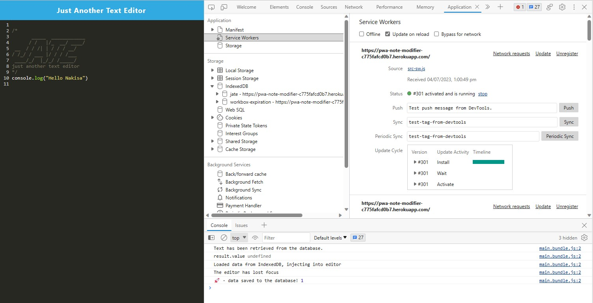

# Progressive Web Applications (PWA): Text Editor

## Description

Progressive Web Applications (PWA): Text Editor is a web application that allows users to create and store notes or code snippets with or without an internet connection. It features reliable data persistence and offline functionality, making it convenient for developers to access their content anytime, anywhere. The application follows the PWA criteria and incorporates various data storage techniques such as IndexedDB.

## Table of Contents

- [Description](#description)
- [Features](#features)
- [Acceptance Criteria](#acceptance-criteria)
- [Installation](#installation)
- [Usage](#usage)
- [Technologies Used](#technologies-used)
- [Link for This Application](#Link-for-This-Application)
- [Contributing](#contributing)

## Features

- Create and store notes or code snippets
- Offline functionality for accessing content without an internet connection
- Reliable data persistence using IndexedDB
- Responsive design for optimal user experience on different devices

[🔼back to table of contents ](#table-of-contents)

## Acceptance Criteria

- When opening the text editor application, the client server folder structure should be visible.
- Running `npm run start` from the root directory should start up the backend and serve the client.
- Running the text editor application should bundle the JavaScript files using webpack.
- Running webpack plugins should generate an HTML file, service worker, and a manifest file.
- The text editor should function without errors when using next-gen JavaScript.
- Opening the text editor should immediately create a database storage in IndexedDB.
- Entering content in the text editor and clicking off the DOM window should save the content with IndexedDB.
- Closing and reopening the text editor should retrieve the saved content from IndexedDB.
- Clicking on the Install button should download the web application as an icon on the desktop.
- The web application should have a registered service worker using workbox.
- Static assets should be pre-cached upon loading, including subsequent pages and static assets.
- Deploying to Heroku should include proper build scripts for a webpack application.

[🔼back to table of contents ](#table-of-contents)

## Installation

1. Clone the repository: git clone <git@github.com:Nakisa-Alipour/pwa-text-editor.git>

2. Install the dependencies: `npm install`

3. Start the application: `npm start`

[🔼back to table of contents ](#table-of-contents)

## Usage

- Open the web application in your preferred browser.
- Create new notes or code snippets.
- Edit and save your content.
- Access your content offline.

**PWA Text Editor Page**

**PWA Text Editor- App Manifest**

**PWA Text Editor- Social Workers**

**PWA Text Editor- DB**

[🔼back to table of contents ](#table-of-contents)

## Technologies Used

- HTML
- CSS
- JavaScript
- IndexedDB
- Webpack
- Service Worker
- Manifest

[🔼back to table of contents ](#table-of-contents)

## Link for This Application
in Heroku: https://pwa-note-modifier-c775fafcd0b7.herokuapp.com/

[🔼back to table of contents ](#table-of-contents)

## Contributing

Contributions to the Social Network API are welcome! If you have any improvements or bug fixes, feel free to submit a pull request.

[🔼back to table of contents ](#table-of-contents)

